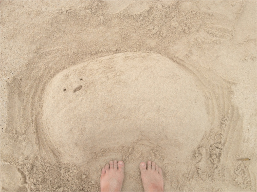
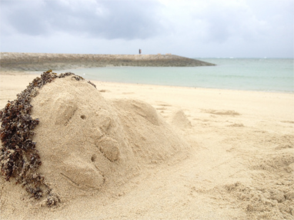

# 31days企画
  何回か挑戦してるけど、ことごとく失敗してるあの企画。再び

## ルール
  - 毎日続ける。
  - でも、無理しない。
  - 何をやったのか記録する。

### 補足
特に何をしないといけないという縛りはないっす。  
今度こそ達成するためにY氏に協力してもらってまふ。

## Diary
### 2015/07/01
リポジトリ作成

### 2015/07/02
sublime text2 から 3へアップグレード  
あと、markdownを学ぶためにretext入れたヽ(=´▽`=)ﾉ

### 2015/07/03
sublime text3 をカスタマイズ…
まだ途中です(´・ω・｀)

### 2015/07/04
sublime text3で日本語入力を一応…できるようにした。(納得はしていない)  
明日から何か書くぞー　何をやろう…(；´∀｀)

### 2015/07/05
とりあえずサークルのマスコットキャラの  
おおさんしょううおのゲームを作ろうと思う  
手始めにenchantjsを触ってみようかな( ｰ`дｰ´)

### 2015/07/06
おおさんしょううおを表示することができた。  
あと、なんかうまくpushできてなかったところも解決したヽ(=´▽`=)ﾉ

### 2015/07/07
さんしょううおを左右と上に移動できるようにした。  
そして、枠を通り過ぎないように判定もつけた。

### 2015/07/08
実はサボった。  
サークルのメンバーが「ハムスターみたい」と言っていたので、  
ハムスターみたいにしましたヽ(=´▽`=)ﾉ← 

### 2015/07/09
背景画像を追加。  
あと、もうちょっとまとめたかったので  
先生と相談してGroupを使ってみた。使い方合ってるかな？

### 2015/07/10
ぼっち台風ソン←  
台風のせいでwi-fiがブチブチ切れる事案発生:(；ﾞﾟ'ωﾟ'):  
pushできないぃぃぃぃぃ  
滑車で遊ぶさんしょううおに、池で泳ぐ(?)さんしょううおを追加。  
↑キーで滑車に、→キーで池に。  
↓と←キーで元の位置に戻るようにした。

### 2015/07/11
さんしょうおが乗った時だけ滑車が動くようにした。  
そして、クソースを先生のアドバイスで少しなおした(；´∀｀)

### 2015/07/12
明日の作業のために素材を作った。  
素材のデザインで悩んだ割には１分でできるようなボタンに…

### 2015/07/13
昨日作ったボタンをクリックすると  
さんしょうおがランダムに増えるようになった。(誰得なんだろうか…)  
もうひとつボタン作ったけど、中身を書いてないでござる。  
さんしょうおを増やすのはいいけど、  
表示する前にﾁﾗｯと左上に表示されるのが気になるこの頃。

### 2015/07/14
ボタンをクリックするとランダムで表示されたさんしょうおを消すのはやめて、  
ランダムで作成されたさんしょうおは右にどんどん流れていくってやつを作った。  
なんか動きがおかしいけど、これは明日やろうと思う。

### 2015/07/15
弟に誕生日プレゼントを渡せないまま学祭準備…。  
スマホでも操作できるようにpadを入れてみた。ヽ(=´▽`=)ﾉ  
あと何かに使おうと思って作ったはずのpoolが全く必要がないことに気づいたので、  
消しましたん

### 2015/07/16
学祭準備のためゆるーくやるです(；´∀｀)  
今まで作った素材をimagesに入れた。

### 2015/07/17
一応昨日までやったものは完成ってことで。  
今日から新しいものやるよん。今度はゲーム性とやらをつけようとおもうのだ。  
まずは必要な素材を揃えた。

### 2015/07/18
今日から新しくさんしょうおのゲームを作るっす。  
まずはさんしょうおを表示するところから

### 2015/07/19
さんしょうおを移動できるようにした。
あ、わざわざ書いているのは覚えるためです。

### 2015/07/20
移動したらframeが動くようになったけど、まだ確定ではない。  
あとビーチパーティに行って砂で、さんしょうおとアザラシ作った。

### 2015/07/21
frameの動き方をいろいろ試しているところ。  
あと上下と左右の移動スピードを変えてみた。  
ﾈﾑｲ(´･ωゞ)

### 2015/07/22
さんしょうおが画面からはみ出ないようにした。  
あと、左に移動するときにちゃんと画像が左に向くようにした。 
そして、おかんの妊娠がしたらしい:(；ﾞﾟ'ωﾟ'):

### 2015/07/23
なかなか背景画像のイメージが決まらなく、  
とりあえず下に移動できる距離を制限した。

### 2015/07/24
とりあえず背景画像を作った。川に流されるイメージ←  
台風来るっぽいので、明日から本気だす(多分)

### 2015/07/25
うーん。とりあえず、敵さん出した。  
明日は当たり判定くらいできたらいいな。

### 2015/07/26
スマホでも操作できるようにして、  
飛んでくるボールに当たるとゲームオーバーになるようにした

### 2015/07/27
フルーツが飛んでくるようになった。  
わんこが私の寝床にゲロってた…

### 2015/07/28
スコアを出せるようにしたー。

### 2015/07/29
りんごからパインに変えた。(メンバーの要望により)  
残りはゆるゆると書いていくだ

### 2915/07/30
ちょっと今まで書いてきた書き方と違う方法でも試したくなったので  
さんしょうおのゲーム2ってのを作る。間に合うといいのだけど…(；´∀｀)